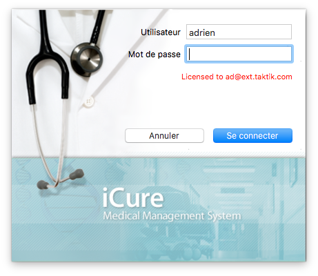

********************
Bienvenue dans iCure
********************

iCure est un logiciel de gestion de dossiers médicaux qui couvre l’encodage des patients et des consultations successives, des médecins... ainsi que le classement de ces données dans le but d’obtenir une recherche efficace des différents éléments. Il offre différentes fonctionnalités essentielles à la pratique médicale comme des prescriptions, des lettres types et autres attestations. Il enregistre des rappels, se synchronise avec iCal et le Carnet d’Adresses.

Parfaitement adapté au système d’exploitation MacOS X, iCure bénéficie de la stabilité Macintosh ainsi que de sa résistance aux virus et autres attaques. Ce logiciel, en plus d’être sécurisant, s’utilise facilement.

Conçu pour les médecins généralistes, spécialistes et clini- ciens, iCure se transforme pour s’adapter à l’évolution de la pratique médicale. Il offre à ses utilisateurs une très grande flexibilité. En effet, la gestion des dossiers patients est entièrement personnalisable.

Le médecin alimente le logiciel via des formulaires qui peuvent être créés, ou simplement adaptés, pour servir les besoins de l’utilisateurs. Il est possible de faire de même avec les rapports, qui peuvent eux aussi être modelés à la convenance de chacun. Une fois enregistrée dans iCure, l’information peut être visualisée de diverses manières. Les éléments contenus dans chaque dossier pa- tient sont accessibles en un clic. Toute donnée peut être retrouvée grâce à un champ de recherche toujours accessible. Le logiciel vous permet de classer la donnée suivant différents facteurs. Il suffit d’utiliser des filtres existants, ou d’en créer de nouveaux.

La richesse des options de visualisation permet une locali- sation ciblée et rapide des informations clefs du dossier. iCure per- met de trouver n’importe quelle donnée sans pour autant devoir parcourir l’ensemble du dossier. Lorsqu’un médecin est face à un patient, il a directement accès aux antécédents de son dossier médical. Il peut en ressortir instantanément toute donnée néces- saire à poser un diagnostic adapté. Grâce aux filtres, iCure enrichit et complète l’approche purement chronologique des soins de santé, permettant de choisir un objet d’attention (élément de soin, démar- che, patient...) auquel s’applique la recherche.

Si iCure assure la traçabilité de tous les dossiers, c’est sans pour autant sacrifier clarté, consistance et concision. iCure s’articule sur la notion de problèmes de santé (ou éléments de soin) que rencontrent le patient. L'élément de soin devient structurant et fondamental.

iCure est conçu pour faciliter le travail quotidien de ses util- isateurs. C’est plus qu’un simple logiciel, c’est un confort de vie, de travail.

Contactez-nous
==============

Si vous désirez obtenir de plus amples informations sur iCure, nous vous invitons à consulter le site web : http://www.icure.eu/

Derrière ce logiciel, se trouve toute une équipe prête à vous répondre :

| **Pour obtenir l’information commerciale :** `info@icure.eu`_
| **Pour obtenir la réponse à un problème** : support@icure.eu
| **Tél. :** +32(0)2 333 58 40
| **Fax. :** +32(0)2 648 16 53
| **Adresse :** Taktik, Grote baan 225 1620 Drogenbos (Brussels)

.. _info@icure.eu: mailto:info@icure.eu

.. error:: Adresse incorrecte !

iCure, un programme labellisé
=============================

iCure respecte la structuration du dossier médical telle que proposée par le Ministère de la santé.
C’est le programme MacOS X qui répond parfaitement à l'ensemble des critères de labellisation.
C'est pourquoi les médecins généralistes utilisateurs d'iCure peuvent bénéficier d’une prime de 743 euros par an.

La labellisation d’iCure signifie que ce programme est doté d’un format de données ouvert garantissant une inter-opérabilité entre logiciels labellisés.
Bien que les données peuvent s’échanger facilement, iCure reste garant du secret médical.
Les données introduites dans la base de données iCure restent personnelles et confidentielles.
iCure vous apporte l’assurance de la sécurité des données.

Dans le but de vous facilitez la compréhension, voici la définition de quelques notions communes aux programmes labellisés pour médecins :

**Élément de soin**
  [problème de soin, problème de santé] : Entité pathologique ou non pouvant justifier aux yeux du patient une prise de contact avec un prestataire de soin et devenant, de ce fait, un élément structurant du dossier .

**Démarche**
  Ensemble de services sous la responsabilité d'un seul prestataire dans le cadre d'un seul élément de soin [Episode de soin]. On peut éventuellement lui associer une notion d'objectif.

**Service**
  [procédure, action, prestation, information] : Toute manipulation (ajout ou modification) d'information par un prestataire (utilisateur iCure dans ce cas) au sein du dossier patient.

**Sous-contact**
  [journalier, fiche de consultation, formulaire de visite] : Ensemble des services spécifiquement liés à une démarche (et donc liés à un seul élément de soin), collectés au cours d'un contact de soin .

**Contact de soin**
  Ensemble de services validés au même moment par un prestataire.

**Prestataire**
  [utilisateur d'iCure] : un ou une équipe de professionnels (labo, ...) re- connus, susceptibles de délivrer des services (et par là même d'al- imenter le dossier médical en information).

Installer iCure
===============

Voici comment procéder à l’installation de iCure sur votre Macintosh.

.. attention::

  Ceci est la procédure pour l'ancien iCure (3.7.2)
  Il n'y a pas encore de solution simple pour l'installation d'iCure 4

.. admonition:: Pour installer iCure

  1. Double-cliquez sur l’image iCure.dmg.
  2. Glissez l’icône iCure dans le dossier Applications.
  3. Si nécessaire, introduisez l’identi ant administra- teur et son mot de passe.
  4. Double-cliquez sur iCure.
  5. Introduisez votre licence iCure.
  6. La fenêtre smartcrash s’ouvre, cliquez sur oui.
  7. Introduisez vos coordonnées.
  8. Introduisez un login et un mot de passe pour ren- trer dans iCure.
  9. Appuyez sur démarrer.

.. COMMENTAIRE - Il faut ajouter ici une nouvelle procédure pour le premier lancement
  après installation, avec des captures d'écran.

Accéder à iCure
===============

A chaque fois que vous démarrez le programme, vos login et mot de passe vous sont demandés.
Le but est de garantir la confidentialité des dossiers patients.
De cette manière, ils ne seront consultables que par les personnes possédant un nom d’utilisateur et un mot de passe.

.. admonition:: Pour accéder à iCure

  1. Double-cliquez sur l'icône d'iCure pour démarrer le logiciel, une fenêtre de connexion apparaît.
  2. Introduisez votre nom d’utilisateur et votre mot de passe dans les champs adéquats.
  3. Cliquez sur « Login ».

iCure en un coup d'oeil
=======================

Ouvrez plusieurs fenêtres à la fois (raccourci «⌘-N»).
Cette possibilité d’ouverture simultanée de fenêtres iCure permet, par exemple, de travailler sur un dossier patient tout en visualisant la fiche administrative de son médecin, d’ouvrir plusieurs dossiers en même temps...

La fenêtre iCure
----------------

.. image:: images/screenshot_main_window.png

1. La **barre de sélection des modules** sert à passer d’un module à l’autre.
2. La **barre d’outils** permet d’effectuer une série d’actions propres à chaque module.
3. Le **champ de recherche** permet de retrouver des éléments et d’effectuer une sélection sur base de critères pré déterminés.
4. L’**inspecteur** permet de faire apparaître la fenêtre Sélection qui propose certaines actions de configuration.
5. Cette **colonne de gauche** permet d’agir dans le module choisi ou encore sur la hiérarchie d’un dossier patient sélectionné. De cette colonne, il est possible d’accéder aux différents éléments de la structure interne du module.
6. La **fenêtre principale** permet de remplir les champs et donc de compléter iCure.
7. Les **boutons d’actions** |bouton_action| permettent d’ajouter ou supprimer des éléments et proposent une série de fonctions.

La colonne de gauche dans un dossier patient
--------------------------------------------

|icon_f_a| **Fiche administrative** : Accès à la fiche administrative du patient.

|icon_r_p| **Résumé Patient** : Visualisation du contenu du dossier. Médecins : Visualisation des médecins le traitant.

|icon_files| **Fichiers** : Visualisation des différents fichiers contenus dans le dossier.

|icon_planning| **Planning** : Visualisation des rappels.

|icon_vaccines| **Carnet de vaccinations** : Visualisation des vaccins.

|icon_medicaments| **Médicaments** : Visualisation des prescriptions réalisées. Transactions : Visualisation des différents services effectués.

**Boîte aux lettres (Inbox)** : Visualisation les résultats de laboratoire.

.. error::
  La fonction de **Boîte aux lettres (Inbox)** ne semble plus être disponible pour le moment dans la version 4.0.0

|icon_element_de_soin| **Elément de soin** : Visualisation des démarches et des services que ces dernières contiennent effectués concernant ce problème de santé.

  |icon_demarche| **Démarche** : sous-section de l'élément de soin contenant des services.

    |icon_finalized_document| **Document finalisé** : document imprimé.

    |icon_document| **Document non finalisé** : document à imprimer

    |icon_form| **Formulaire**.

**Dossier intelligent** : Visualisation d'un type d'information (extraite de l'ensemble du dossier en fonction de critères préétablis.

.. error::
  La fonction de **dossier intelligent** ne semble plus être disponible pour le moment dans la version 4.0.0

.. |icon_files| image:: images/icon_files.png

.. |icon_planning| image:: images/icon_planning.png

.. |icon_medicaments| image:: images/icon_medicaments.png

.. |icon_element_de_soin| image:: images/icon_element_de_soin.png

.. |icon_form| image:: images/icon_form.png

Utilisation de l'inspecteur
---------------------------

Il existe deux inspecteurs dans iCure. Leur contenu varie en fonction de l’élément sélectionné.
Le premier inspecteur est voué à la sélection, celui- ci varie (élément de soin, formulaire...), le deuxième concerne le service (toute ajout ou modification d'information par un utilisateur iCure au sein du dossier patient).

Dans l’exemple ci-dessous, les deux inspecteurs sont actifs.

|icon_inspector| Cliquez sur cet icône et les fenêtres Inspecteur «Sélection» et «Attributs» s’ouvriront.
Leurs contenus varient en fonction de l’élément sur lequel vous cliquez, module dans lequel vous vous trouvez.

.. |icon_inspector| image:: images/icon_inspector.png

Dans cet exemple, un service a été sélectionné dans un élément de soin.

.. error::
  | exemple impossible à reproduire dans la version 4.0.0
  | L'inspecteur de service ne réagit à aucune selection

Les préferences iCure
---------------------

Dans vos Préférences iCure, plusieurs onglets vous donnent accès aux règlages du logiciel.

1. Les **préférences "General"** sont celles que vous pouvez observer ci-dessus. Elles concernent l’utilisation du logiciel dans son ensemble.
2. Les **préférences "Lab results"** vous permettent de déterminer l’emplacement de départ dans lequel ces résultats se trouveront et de décider du sort du document après l’importation.
3. Les **préférences "Communication"** permettent de configurer l'accès au différents systèmes externe à iCure.
4. Les **préférences "Prescriptions"** concernent la réalisation des ordonnances ainsi que leur impression.
5. Les **préférences "Dossier médical"** permettent de décider quels types éléments seront visualisés dans chaque dossier patient.
6. Les **préférences "Matrix printer",** sous "Tarification", permettent de configurer l'impression matricielle des bons de mutuelle pour imprimante à aiguilles

.. admonition:: Remarque

  les différents onglets seront expliqués plus en détails dans les points correspondant à leurs fonctions.
