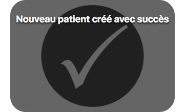
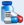
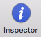
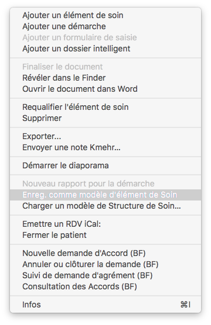

*******************
Trouver ses repères
*******************

Cette partie du manuel a pour but de familiariser l’utilisateur à iCure.

Naviguer dans iCure
===================

Ce logiciel fonctionne selon plusieurs principes simples de navigation.

.. tip:: Pour naviguer dans iCure.

  - Barre d'onglets.
  - Raccourci clavier nouvelle fenêtre « ⌘-N ».
  - Raccourcis clavier vers modules « Option (⌥)-1 » à « Option (⌥)-9 ».
  - Ouvrez un autre module en cliquant 1 seconde sur le + dans la barre d'onglet.
  - Cliquez sur la croix à gauche de l'onglet dans lequel vous êtes pour le fermer. (Vous ne pouvez pas fermer le 1er onglet)

Vous pouvez, à tout moment, ouvrir une nouvelle fenêtre principale en choisissant "Nouvelle fenêtre" dans le menu fichier ou en util- isant le raccourci « ⌘-N ».

Il est possible de travailler avec plusieurs fenêtres ouvertes simultanément.

Une croix à côté du nom du patient vous permet, à tout moment, de refermer un dossier patient |screenshot_en-tete_patient| pour accéder à la liste de vos patients.

.. |screenshot_en-tete_patient| image:: images/screenshot_en-tete_patient.png

Pour tous les autres modules, vous trouverez une croix placée directement sur l'onglet du module.

.. image:: images/screenshot_close_module.png

.. note::
  Si vous n’êtes pas dans un dossier, la liste vous est proposée mais il n’y a pas de croix. Vous pouvez choisir d’ouvrir n’importe quel dossier.

.. image:: images/screenshot_tab_patient.png

La barre d'onglet vous permet de passer d'un module d'iCure à l'autre.

Appuyez sur le bouton "+" pendant une seconde, un menu vous propose alors une sélection des modules.

.. image:: images/screenshot_open_module.png

Ce menu de sélection des modules permet d'ouvrir facilement un autre module.

Vous pouvez aussi accéder directement à un module via le menu Outils ou grâce à un raccourci clavier :

- Rapports : « ⌥ 0 »
- Dossiers Patients : « ⌥ 1 »
- Messages : « ⌥ 2 »
- Médecins : « ⌥ 3 »
- Personnel : « ⌥ 4 »
- Médicaments : « ⌥ 5 »
- Hôpitaux : « ⌥ 6 »
- Formulaire : « ⌥ 7 »
- Modèles : « ⌥ 8 »
- Assurance : « ⌥ 9 »

Dans la partie supérieure de la fenêtre principale se trouve la barre d'outils avec les fonctionnalités de base (dans ce cas, celles du module « Dossiers patients ») :

.. image:: images/screenshot_toolbar_patient.png

Cette barre d’outils évolue, comme vous allez le voir ci-dessous, en fonction du module dans lequel vous vous trouvez. Certains éléments sont communs.
Les autres varient pour vous proposer les fonctionnalités adéquates à l’usage du module.

Les éléments communs à tous les modules sont :
----------------------------------------------

- **Imprimer**
- Le **champ de recherche** permet de faire une recherche sur l'ensemble des éléments ou selon l'élément sélectionné.
  La recherche peut également se réaliser en fonction de filtres accessibles par la petite flèche dans le champs de recherche.
- **L'inspecteur** permet d'avoir accès à la fenêtre "Objects" permettant des actions différentes selon l'élément sélectionné.

Les éléments particuliers à chaque module sont :
------------------------------------------------

Module "Dossier Patients"
^^^^^^^^^^^^^^^^^^^^^^^^^

.. image:: images/screenshot_toolbar_module_patient.png

- **Nouveau patient** permet d'ajouter un nouveau patient à votre logiciel.
- **Effacer patient** permet de supprimer un patient.
- **Nouveau formulaire** permet d'ouvrir un nouveau formulaire. Vous pouvez en choisir le modèle en fonction du besoin du moment.
- **Nouvelle visite** permet d'ouvrir un formulaire de consultation d'un clic.
- **iCal** permet d'enregistrer un rendez-vous sur iCal directement à partir du dossier d'un patient.
- **Planning** permet d'inscrire des rappels dans la fenêtre de plannings.
- **Introduire les codes** INAMI de prestation
- **Prescrire** permet de confirmer la création d'une prescription ou de renouveler facilement une ancienne.
- **EID** permet d'ouvrir et de mettre à jour un patient à partir de sa carte d'identité
- **Imprimer.Etiq** permet d'imprimer une fiche d'identification du patient au format étiquette.
- **Accès/notif**
- **Date saisie** permet de définir l'heure de la consultation

.. \* ces fonctions n’apparaissent dans la barre d’outil que lorsque vous êtes dans un nouveau rapport.

Module "Dossier Patient" > Création de rapport
^^^^^^^^^^^^^^^^^^^^^^^^^^^^^^^^^^^^^^^^^^^^^^

.. image:: images/screenshot_toolbar_module_rapport.png

- **Nouveau rapport** permet d'ouvrir un nouveau rapport. Vous pouvez choisir d'ouvrir le type de modèle de lettres ou autres certificats que vous voulez.
- **Isérer le modèle** permet d'utiliser un modèle de rapport enregistré.
- **Sauver le modèle** permet d'enregistrer un rapport comme modèle afin de pouvoir le réutiliser.
- **Transmettre** permet de sauvegarder le rapport sous forme d'un fichier en dehors du programme et éventuellement de l'échanger avec d'autres médecins.

Module "Prestataires de soins"
^^^^^^^^^^^^^^^^^^^^^^^^^^^^^^

.. image:: images/screenshot_toolbar_module_doctor.png

- **Nouveau prestataire de soins** permet d'ajouter un nouveau médecin. Une fiche administrative vierge s'ouvre vous permettant de lier le nouveau docteur à un ou plusieurs patients ainsi qu'à une ou plusieurs institutions hospitalières.
- **Supprimer prestataire de soins** permet de supprimer un médecin.

Module "Messages"
^^^^^^^^^^^^^^^^^

.. image:: images/screenshot_toolbar_module_messages.png

- **Marquer comme lu** permet de sélectionner plusieurs messages et de les marquer comme ayant été ouverts(lu).
- **Marquer non-lu** permet de donner un mail consulté l'apparence de ne pas avoir été ouvert.
- **Ouvrir le patient** permet d'ouvrir le parient dont le mail parle.
- **Nouveau message** permet de rédiger un nouveau message.
- **Répondre** au message sélectionné.
- **Actualiser** pour recharger le contenu du dossier ouvert.
- **Nouvelle demande d'agrément**
- **Envoyer les messages Efact sélectionnés** permet d'envoyer des factures qui seraient en attente dans la boite d'envoi
- **Purger les vieux messages**

Modules "Administration"
^^^^^^^^^^^^^^^^^^^^^^^^

.. error:: Données insuffisantes pour compléter cette documentation

Le module d'administration reprend plusieurs page d'informations concernant les Utilisateurs, les Assurances, les réplications, les codes, les mutuelles, les codes de tarifications...

.. liste de module présent dans la version 3.7.2 mais pas trouver dans la version 4.0.0
  -> sont probablement repris par le module d'administration
  Module "Rapport"
  Module "Médicaments"
  Module "Utilisateurs"
  Module "Formulaire"
  Module "Hopitaux"
  Module "Assurance"
  Module "Modèles"
  Module "Filtres"

Effectuer une recherche
=======================

Toute recherche au sein d’iCure se base sur le même principe. Un champ de recherche s’applique à chaque élément sélectionné.

.. tip::
  Faire une recherche

  - Utilisez le champ de recherche.
  - La flèche à côté de la loupe dans le champ de recherche permet d’accéder aux différentes options.
  - La recherche est effectuée parmi les patients si aucun patient n’est sélectionné.
  - La recherche se fait dans l’élément sélectionné d’un dossier si un patient est sélectionné.

.. image:: images/field_search.png

Le champ de recherche est accessible à tout moment dans iCure.
Les données sur lesquelles la recherche s'effectue dépendent du contexte.
Ainsi, la recherche se fera toujours au sein du module sélectionné dans la barre d'onglet.

**Par exemple,** prenez le module « Dossiers patients ».

Tout ce qui suit concerne ce module mais le processus de recherche
est semblable dans les autres modules.

**Lorsqu'un patient est sélectionné,** son nom apparaît dans la colonne de gauche.
Le titre de la fenêtre change également pour prendre le nom du patient.
Une croix à côté de l'icône du module vous permet, à tout moment, de refermer le dossier de ce patient.
Pour accéder à la liste de vos patients, cliquez sur cette croix.

**Si aucun patient n'est sélectionné,** la colonne de gauche reste vide et la recherche s'effectue sur l'ensemble des dossiers patients.

Lorsque rien n’est encodé dans le champ de recherche, votre iCure affiche la liste des patients par ordre chronologique inversé.
Les derniers dossiers patient consultés se trouvent en haut de la liste.

Le contenu de cette liste est déterminé par la configuration de votre logiciel (voir l’onglet « Général » des Préférences iCure).

Si vous voulez obtenir la liste entière de vos patients, tapez le signe « % » dans le champ de recherche.

La liste complète apparaît.

.. image:: images/screenshot_search_percent.png

.. tip::
  Le fait d’entrer le signe « % » dans le champ de recherche permet, de manière générale, dans iCure, d’obtenir la liste de données attenantes aux modules dans lequel vous vous trouvez.

Tapez quelques lettres dans le champ suivies du signe «%», une liste s’affichent avec tous les noms de patients, médecins, hôpitaux... commençant par les lettres encodées.

.. image:: images/screenshot_search_demo_percent.png

Les colonnes de la zone de recherche affichent le nom, le prénom, la date de naissance, adresse, téléphone, le numéro NISS du patient, "Contenu" pour une recherche sur le contenu, "Tout" pour effectuer une recherche sur l'ensemble des critères.

Pour effectuer une recherche, choisissez le type de données voulu. Encodez les premières lettres du mot recherche, votre iCure fait le reste.

La flèche, à côté du champ de recherche , vous permet (dans le module patient) d’accéder aux filtres et de les appliquer sur l’ensemble des patients.

.. image:: images/screenshot_search_filter.png

**Si aucun patient n’est sélectionné,** la recherche porte sur l’ensem- ble des patients. Encodez les premières lettres, des colonnes s’affichent dans la zone de droite de la fenêtre.

Vous pouvez cliquer sur n’importe quel élément (Nom, ID, NISS, Date nais.)

Les données correspondant à votre recherche s’affichent dans ces colonnes.

**Si un patient est sélectionné,** la recherche dépend de l'élément sélectionné dans la hiérarchie à gauche de l'écran.

**Si la fiche administrative ou le dossier ”Transactions“ sont sélectionnés,** c'est sur l'ensemble des données médicales du patient que se fait la recherche.

.. image:: images/screenshot_search_transactions.png

Les critères de recherche sont : Intitulé, Valeur, Classes, Codes, Propriétaire.

Comme lorsqu’aucun patient n’est sélectionné, les données correspondant à votre recherche s’affichent dans ces colonnes.

**Si ”Médecins“, ”Fichiers“, ”Vaccins“ ou ”Planning“ sont sélectionnés,** la recherche porte sur les données correspondantes (médecins, fichiers, vaccins ou planning). De la même manière, si un dossier in- telligent, une démarche ou un élément de soin font l'objet de la sélection, la recherche est limitée aux éléments contenus dans ce dossier.

Créer un nouveau patient
========================

Ce point est destiné à l’explication du processus de création d’un nouveau dossier patient et à la complétion de sa fiche administrative.

.. note::
  Pour créer un nouveau patient :
    1. Cliquez sur l'icône nouveau patient |bouton_new_patient| dans la barre d'outils du module "Dossiers patients"|bouton_list_patient|.
    2. Encodez les informations du patient.
    3. Cliquez sur les différents éléments pour prendre connaissance du dossier.

.. |bouton_new_patient| image:: images/bouton_new_patient.png

.. |bouton_list_patient| image:: images/bouton_list_patient.png

Lorsque vous cliquez sur l'icône |bouton_new_patient| dans la barre d'outil du module "Dossier patients"|bouton_list_patient|, iCure ouvre une nouvelle fiche patient.

Un message indique le succès de l'opération.

Vous pouvez insérer les informations administratives dans la fiche nouveau patient.

Pour ce faire, cliquez dans les différents champs et encodez les données.

.. tip::    Les informations que vous encodez sont automatiquement enregistrées. Il n’est pas nécessaire de sauvegarder quoi que ce soit.

Certains champs permettent l’auto-complétion et ce, pour accélérer votre travail d’encodage.
Si, par exemple, vous désirez encoder une langue ne se trouvant pas dans la sélection proposée, iCure la retient et vous la propose automatiquement lors des prochains encodages.

.. error::
  24/02/2017
    - Le champs de langue ne peux plus être édité une fois le patient fermé
    - Les propositions automatique ne fonctionnent plus

Lorsque vous encodez un code postal (belge), une liste de villes qui y sont liées vous est proposée. Sélectionnez celle qui vous intéresse.

.. note::
  La section "personne de contact" permet d’encoder les informations relatives à une personne responsable du patient comme dans le cas d’un mineur.

Vous pouvez choisir de masquer certains éléments de la fiche administrative en cliquant sur les flèches à gauche des parties rétractables de la fiche administrative.

Inscrivez, par exemple, dans le champ notes, certaines remarques sur le patient puis refermez ce champ afin d'en masquer le contenu.

Structure du dossier patient
============================

iCure offre la possibilité au médecin de classer ses données selon une structure mise en avant par le Ministère de la santé, mais surtout selon vos préférences personnelles.

.. admonition:: Points clés sur les éléments de structure des dossiers patients.

  • La visualisation des différents éléments du dossier médical se réalise dans la zone de gauche de la fenêtre.
  • Des éléments fixes, communs à tous les dossiers médicaux, se retrouvent dans la structure.
  • Vous pouvez décider de ceux qui seront visibles dans les Préférences iCure dans l’onglet dossier médical.
  • D’autres éléments sont propres à chaque patient (cfr. Eléments de soin différents).
  • Les « Transactions » |icon_transactions| donnent une chronologique des différentes consultations vue.
  • Le dossier « Etat général/Vaccination/Médication» |icon_health_element| donne une vue de toutes les démarches contenue dans l'élément. Cette seconde visualisation est orientée problème de santé.
  • Vous pouvez ajouter autant d’éléments de soin |icon_health_element| que vous le désirez dans un dossier patient.
  • Et dans ces éléments de soin |icon_health_element|, autant de démarches/plans d'action |icon_demarche| que vous le voulez.
  • Les formulaires |icon_form| et rapports |icon_document| pré enregistrés s'insérent dans les démarches/plans d'action |icon_demarche| en cliquant respectivement sur Nouveau Formulaire |bouton_nouv_form| et Nouveau Rapport |bouton_nouv_rapport|.
  • Pour créer un rapport |icon_document|, sélectionnez la démarche |icon_demarche| dans laquelle vous voulez l'insérer puis allez dans le menu Action |bouton_action_menu| où vous devez choisir "Nouveau rapport pour la démarche".
  • Les dossiers intelligents filtrent l’information.

.. error:: Les dossiers intelligents ne semblent pas être disponible dans la version 4.0.0

.. |icon_transactions| image:: images/icon_transactions.png

.. |icon_demarche| image:: images/icon_demarche.png

.. |icon_form| image:: images/icon_form.png

.. |icon_document| image:: images/icon_document.png

.. |bouton_action_menu| image:: images/bouton_action_menu.png

Dans iCure, travaillez à partir du Dossier Patient. Vous pouvez y effectuer la plupart des actions.

| Entrez l’information via des formulaires que vous avez la possibilité de concevoir entièrement dans le module "Formulaire".
| Visualisez l’information dans vos dossiers patients iCure.
| Créez des Dossiers Intelligents pour filtrer les données et n’en extraire que celles dont vous désirez obtenir l’accès rapide.

Voici un schéma illustrant le cheminement de l’information dans iCure.

.. error:: schéma manquant (voir doc iCure 3)

Depuis la liste des patients, ouvrez un patient.
Voici comment se présente la fenêtre.

La zone de gauche affiche la structure hiérarchique du dossier médical. Cette structure reste la même pour tous vos patients.

Vous y trouvez des éléments tels que la **fiche administrative** |icon_fiche_administrative|,
le **résumé patient** |icon_resume_patient| qui rassemble le contenu du dossier médical pour un accès direct à vos données,la liste des **médecins** |icon_doctors| qui traitent aussi votre patient,
les fichiers intégrés par « glisser-déposer » |icon_files|, les **planifications** |icon_planning|, les **vaccins** |icon_vaccines| et les **prescriptions** |icon_medicaments|).

**L’élément «Transactions»** |icon_transactions| permet de détailler rapidement, de manière chronologique, les différentes consultations effectuées pour ce patient.

**L’élément «Etat général/Vaccination/Médication»** |icon_health_element| permet de consulter tous les démarches et services promulgués à ce client par le passé concernant cet élément de soin.
Les valises à croix rouges, éléments de soin, peuvent à tout moment être rajoutée

Vous pouvez également configurer une série de **dossiers intelligents** qui permettent d’afficher de manière synthétique, pour tous les patients, des données issues de l'ensemble du dossier médical. Les autres éléments (transactions et éléments de soin) sont propres au patient.

.. |icon_fiche_administrative| image:: images/icon_fiche_administrative.png

.. |icon_resume_patient| image:: images/icon_resume_patient.png

.. |icon_vaccines| image:: images/icon_vaccines.png

Organiser l'information
-----------------------

iCure vous offre la possibilité d’organiser vos dossiers patients afin qu’ils soient structurés selon votre vision.
Ce classement des données permet de rechercher plus rapidement des informations et d’associer ces dernières les unes avec les autres à travers ces classements.

.. VERIFIER L'ENCADRE SUIVANT !

.. admonition:: Pour organiser l'information.

  1. Complétez ou modifiez l’information contenue dans la fiche administrative.
  2. Créez de nouveaux éléments de soin, démarches ou services avec le |icon_+|.
  3. Editez un nouveau formulaire avec ???.
  4. Supprimez l'élément sélectionné avec |icon_-|.
  5. Utilisez le bouton d’actions |bouton_action_menu|.
  6. Glissez-déposez les éléments pour changer la structure hiérarchique du dossier.

.. error:: étape 3 incorrecte !

Tout élément de soin (problème de santé) contient des démarches (ensembles de formulaires).
Ces formulaires servent à introduire l’information. Ils contiennent, quant à eux, des services.

Les éléments de soin
^^^^^^^^^^^^^^^^^^^^

Un **élément de soin** (problème de santé) |icon_element_de_soin| est une entité, pathologique ou non, pouvant justifier,
aux yeux du patient, une prise de contact avec un prestataire de soin et devenant, par ce fait,
un élément structurant du dossier .

.. note::
  En bas, à gauche de la fenêtre, une série de 5 boutons |bouton_action| permet d'agir sur la hiérarchie.

.. |bouton_action| image:: images/bouton_action.png

| **Pour ajouter au dossier d’un patient un élément de soin** |icon_element_de_soin|, utilisez le bouton |icon_+|.
| Attention pour ce faire, veillez à ce qu’aucun élément ne soit sélectionné !

**Pour renommer un élément de soin** |icon_element_de_soin|, cliquez sur l’Inspecteur |icon_inspector| pour pouvoir agir dans la fenêtre « Sélection ».

Ecrivez le nom que vous désirez donner à votre moèle dans le champs "description".

.. tip:: Tous les éléments que vous ajoutez dans la hiérarchie peuvent être renommés en cliquant dessus. |screenshot_rename_element_de_soin|

Vous pouvez **fermer un élément de soin** lorsque vous considérez que les soins concernant ce problème de santé sont terminés.

Un signe d’interdiction vous confirme la clôture de l’élément de soin.

Fermer un élément de soin vous permet de retirer des dossiers de visualisation les informations qui ne sont plus d’actualité concernant la santé du patient concerné.
Il est possible de masquer les éléments de soins clôturés afin qu’ils ne puissent plus être vu du dossier patient.
Pour ce faire, décocher «Afficher les éléments de soin clôturés » dans les Préférences iCure « Dossier Médical ».

.. error:: impossible de fermer l'élément de soin dans iCure 4.0.0

Dans cet inspecteur, vous pouvez également **déterminer la gravité** du problème de santé du patient.

Cet Inspecteur "Objets" présente une liste déroulante dans laquelle vous pouvez sélectionner "Codes"

|screenshot_inspector_list| ➔ |screenshot_inspector_list_choice|

Vous pouvez associer un code ICPC-2 ou ICD-10 à l'élément de soin sélectionné.

Pour plus de renseignements sur la procédure de codification ICPC-2 ou ICD-10, lisez le point concernant les codifications.

| **Pour supprimer l'élément de soin** sélectionné, utilisez le bouton |icon_-|.
| Le bouton d'action |bouton_action_menu| reprend les actions possibles concernant l'élément surligné.
| Les éléments de soin peuvent être déplacés par "glisser-déposer" entre les éléments de soins.

Les démarches
^^^^^^^^^^^^^

Une **Démarche** |icon_demarche| est un ensemble de services sous la responsabilité d'un seul prestataire dans le cadre d'un seul élément de soin (problème de santé).
On peut éventuellement lui associer une notion d'objectif.

| **Pour ajouter une démarche au dossier patient,** utilisez le bouton |icon_+|.
| Attention, pour ce faire, il faut qu'un élément de soin |icon_element_de_soin| soit sélectionné !

**Pour renommer une démarche** |icon_demarche|, cliquez sur l'Inspecteur |icon_inspector| pour pouvoir agir dansl a fenêtre "Objects".

Vous pouvez également renommer les démarches en cliquant dessus dans la zone de gauche de la fenêtre iCure.

.. note:: Les démarches peuvent être déplacées par "glisser-déposer" entre les éléments de soins.

Les formulaires
^^^^^^^^^^^^^^^

Un **Formulaire** est un écran de saisie adaptable destiné à contenir l'information également appelée "Service".

**Pour ajouter un formulaire de visite au sein de la démarche,** selectionnez une démarche.

Utilisez le bouton |icon_+| de la barre d'action pour ajouter un nouveau formulaire de visite au sein de la démarche.

Vous pouvez aussi utiliser le bouton "Nouveau Formulaire" |bouton_nouv_form| de la barre d'outil pour ajouter des formulaires.

Le bouton |icon_-| supprime l'élément sélectionné.

Le bouton d'actions |bouton_action_menu| reprend les actions possibles concernant l'élément surligné.

Les formulaires peuvent être déplacés par "glisser-déposer".

Les services
^^^^^^^^^^^^

Un **Service** (procédure, action, prestation, information), équivaut à toute manipulation (ajout, retrait ou modification) d'information que réalise le prestataire (utilisateur iCure dans ce cas) au sein du dossier patient.

**Pour ajouter un nouveau service au dossier patient,** utilisez le bouton |icon_+|.

Attention pour ce faire, il faut qu'une démarche |icon_demarche| soit sélectionnée !

Ce procédé d’insertion de nouveau service directement dans le dossier patient sera très peu utilisé,
les formulaires étant façonnable à souhait dans le module « Formulaire ».
Ce qui permet de créer des modèles de formulaire adaptés que vous pourrez réutiliser, voir le chapitre sur le sujet.

**Dans l'inspecteur Service** |icon_inspector|, vous trouvez l’intitulé du service, sa date valeur et sa date de fin.
Vous pouvez modifier ces deux dernières.
Par défaut, la date valeur correspond au moment où vous avez rempli le formulaire dans lequel ce service se trouve.

Sélectionnez un élément de soin.

Les services contenus dans cet élément de soin s’affichent. Sélectionnez-en un.

L’inspecteur «Attribut» vous permet de visualiser le nom de l’élément de soin (de le fermer, de visualiser les différentes dates et de déterminer une gravité) ou le nom de la démarche.

L'inspecteur "Services" vous offre le choix entre plusieurs types d'inspecteurs dans une liste déroulante.

Chacun de ces types d'inspecteur "Services" propose différentes fonctionnalités comme vous allez le voir ci-dessous.

Attributs :

..error: Remplacé par Attributs dans l'inspecteur Objects

Classes :

Cet inspecteur Service "Classes" permet de visualiser les classes associées au service et d'en ajouter si nécessaire.
Pour ce faire, cliquez sur le |icon_+|.

Une fenêtre s'ouvre. Encodez le début du nom de la classe que vous désirez associer au service ou tapez "%" pour obtenir la liste complète des classes.

Cliquez sur le |icon_-| pour en supprimer.

Vous pouvez établir une classe par défaut. Cette classe sera associée au prochain service que vous créerez.

Codes :

Visualisez les différents codes associés au service et ajoutez-en si besoin en cliquant sur |icon_+|.

Cliquez sur le |icon_-| pour en supprimer.

Propriétés :

Visualisez les différentes propriétés associées au service et ajoutez-en si besoin en cliquant sur |icon_+|.
Il s'agit d'attributs que l'on peut associer à un services.

Cliquez sur le |icon_-| pour en supprimer.

Démarches :

Cet inspecteur Service "Démarches" permet de visualiser la démarche dans laquelle le service se trouve.

Fichiers :

Cet inspecteur Service "Fichiers" permet de voir si un fichier est associé à un service, de sélectionner un fichier pour lui associer ou encore de visualiser le fichier.

Cependant, cela se fait automatiquement. Lorsqu'on glisse un fichier dans une démarche, un service est créé avec le fichier associé.

Enregistrer un élément de soin comme modèle
^^^^^^^^^^^^^^^^^^^^^^^^^^^^^^^^^^^^^^^^^^^

Lorsque dans un dossier, vous avez créé la structure d'un élement de soin pour une pathologie récurrente, vous pouvez enregistrer la structure de ce dossier comme modèle.

Les démarches caractéristiques du traitement seront dès lors sauvegardées et applicables quand vous le voudrez.

.. admonition:: Pour enregistrer un élément de soin comme modèle

  1. Sélectionnez un élément de soin.
  2. Dans le bouton d'actions |bouton_action_menu|, sélectionnez "Enreg. comme modèle d'élément de Soin".
  3. Choisissez le groupe de modèles dans lequel vous voulez enregistrer le nouveau modèle.
  4. Validez.

Pour ce faire, sélectionnez l'élément de soin que vous voulez enregistrer comme modèle.

Prenez, par exemple, le dossier "Cancer" ci-dessous.

Utilisez le bouton d'actions |bouton_action_menu| et sélectionnez "Enreg. comme modèle d'élément de Soin"

Une fenêtre vous demande dans quel groupe de modèles vous voulez l'enregistrer.

Choisissez puis validez. Seuls les groupes que vous avez créés apparaissent dans la liste.
Une fenêtre de recherche vous permet de trouver rapidement le modèle que vous voulez.

Utiliser un modèle d'élément de soin
^^^^^^^^^^^^^^^^^^^^^^^^^^^^^^^^^^^^

Dans le dossier d'un patient, vous pouvez utiliser une structure d'élément de soin (problème de santé) enregistrée.

.. admonition:: Pour utiliser un modèle d'élément de soin

  1. Sélectionnez "Charger un modèle de Structure de Soin" en utilisant le menu d'actions |bouton_action_menu|.
  2. Choisissez le modèle de dossier élément de soin que vous voulez.
  3. Utilisez le champ de recherche si vous avez une grande quantité de modèles.
  4. Validez

Si vous désirez utiliser un modèle d'élément de soin utilisé dans un autre dossier, utilisez le bouton d'actions |bouton_action_menu| et sélectionnez "Charger un modèle de Structure de Soin".

Une fenêtre s'ouvre, vous permettant de choisir le modèle de dossier élément de soin que vous voulez.
Un champ de recherche vous permet de trouver le modèle plus rapidement en y entrant le nom du modèle voulu.

Cliquez sur valider, le modèle choisi se place parmi les autres éléments du dossier

Créer sa propre structure d'élément de soin par défaut
^^^^^^^^^^^^^^^^^^^^^^^^^^^^^^^^^^^^^^^^^^^^^^^^^^^^^^

.. admonition:: Pour créer sa propre structure de soin par défaut.

  1. Sélectionnez un éléments de soin.
  2. Choisissez "Enreg. comme modèle d'élément de Soin" dans le menu d'actions.
  3. Dans la fenêtre qui s'ouvre alors, cliquez sur "Créer" en bas à gauche.
  4. Entrez un nom pour le modèle et cochez la case "Auto insert".
  5. Validez avec le bouton "Create".

Vous pouvez sélectionner une série d'éléments de soin, de démarches et de formulaires de consultation par défaut qui s'affichera dans chaque nouveau dossier patient.

Pour ce faire, sélectionnez un élément de soin.
Dans le bouton d'actions |bouton_action_menu|, choisissez "Enreg. comme modèle d'élément de Soin".

Créez un nouveau modèle en cliquant sur "Créer".

Entrez un nom et cochez la case "Auto insert" puis validez avec le bouton "Create"

Les éléments de soin contenu dans ce modèle par défaut s'afficheront dans chaque nouveau dossier patient de votre iCure.

Les dossiers patients.
----------------------

Lorsque vous créez un nouveau patient ou que vous voulez modifier des données de sa fiche administrative.

Sélectionnez le nom du patient |screenshot_en-tete_patient|.

La fiche administrative s'affiche sur la droite de la fenêtre.

Cliquez dans le champ à modifier ou à remplir.

Résumé Patient |icon_finalized_document|.
-----------------------------------------

.. |icon_finalized_document| image:: images/icon_finalized_document.png

Visualisez le contenu du dossier du patient en cliquant sur "Résumé Patient" dans la colonne de navigation (à gauche).
Les données s'y trouvent rassemblées les unes au dessus des autres.

.. note::
  Ces données sont destinées à la lecture et non à l'encodage, vous ne pouvez dès lors pas modifier les éléments du dossier à cet endroit.

Pour ajouter ou supprimer des éléments, allez dans un problème de santé |icon_element_de_soin|, modifiez ce que vous voulez directement dans les formulaires.

.. error::
  Le résumé reste vide sous iCure 4 ?

Médecins |icon_doctors|.
------------------------

Lorsque vous encodez un nouveau patient, vous pouvez le lier à un ou plusieurs autre(s) médecin(s), spécialistes ou centres hospitaliers.

.. admonition:: Pour ajouter un médecin

  1. Cliquez sur l'icône Médecins |bouton_doctors|.
  2. Cliquez sur |icon_+| pour ajouter un médecin préencodé.

Cliquez sur l'icône |bouton_doctors| pour savoir quel(s) autre(s) médecin(s) traite(nt) le patient sélectionné.

Une liste s'affiche.

Si cette liste ne contient pas le médecin que vous souhaitez y voir, cliquez sur le |icon_+| en bas de la liste.
Vous accédez à la liste exhaustive des médecins que vous avez déjà enregistrés dans iCure.

Si vous désirez enregistrer un nouveau médecin, cliquez sur l'icône |bouton_new_doctor| pour accéder à une fiche d'enregistrement de médecin.

Vous trouverez plus de détails sur l'encodage d'un nouveau médecin dans le point concernant ce sujet.

Fichiers. |icon_files|
----------------------

Lorsque vous êtes dans le dossier d'un de vos patients, iCure vous permet de visualiser en un clic les documents qui lui sont rattachés.
Vous pouvez rapidement ajouter un fichier et, si vous le désirez, visualisez l'entièreté des fichiers attenants à un éléments en lançant un diaporama.

.. admonition::
  Pour ajouter un ou plusieurs fichiers :

  1. Cliquez sur l'icône pour visualiser les fichiers attentants au dossier.
  2. Lancez le diaporama avec le bouton d'action |bouton_action_menu|.
  3. Ajoutez un fichier par "Glisser-déposer" ou avec le |icon_+|.

Cliquez sur l'icône fichier dans la zone de fauche de la fenêtre iCure.

.. error:: rien dans iCure 4 ?

Cet élément Fichiers |icon_files| sert à visualiser rapidement les documents affiliés au dossier patient sélectionné.
Il est donc possible de les faire défiler sous forme de diaporama.

Pour ce faire, utilisez le bouton d'actions |bouton_action_menu| et sélectionnez "Démarrer le diaporama".

Sélectionnez l'élément donc vous voulez voir les fichiers, par exemple, une démarche |icon_demarche|.
Dans ce cas, seuls les documents contenus dans cette démarche s'afficheront dans le diaporama.

**Pour ajouter un nouveau fichier**, cliquez sur le |icon_+| en bas à gauche dans le tableau.

La fenêtre classique d'importation de document s'affiche.

Sélectionnez le fichier que vous voulez importer puis cliquez sur ouvrir.

Il est également possible d'importer un fichier par "Glisser-Déposer" sur l'élément où vous voulez l'importer.

**Remarque** : Il n'est pas possible d'importer un fichier de laboratoire de cette façon.
Pour ce faire, allez voir le point de manuel concernant ce sujet.

Planning. |icon_planning|
-------------------------

Lorsque vous êtes dans le dossier d'un de vos patients, iCure vous permet de visualiser en un clic les différentes notifications, rappels en tout genre, qui lui sont rattachés.

.. tip:: Visualisez les rappels associés à un patient en cliquant sur le dossier Planning |icon_planning|.

Dans la plupart des cas, vous événements seront générés via des formulaires, de manière automatique.

Vous pouvez également ajouter des rendez-vous pour compléter le dossier.

.. admonition::
  Pour ajouter une notification :

  1. Ajoutez une notification avec le |icon_+|.
  2. Enregistrez le rappel comme événement du type ou personnel.

Grâce à cette fonctionnalité, vous pouvez, à tout moment, intégrer un rappel à vos dossiers.

Si vous souhaitez ajouter un événement, cliquez sur le |icon_+|.

Un calendrier vous permet de choisir la date et l'heure de rappel que vous voulez.

Vous pouvez enregistrer ce rappel comme événement type ou comme événement personnel.

Dans le premier cas, choisissez parmi plusieurs intitulés de rappels.

.. AJOUTER SCREENSHOT AVEC PLUSIEURS TYPES EXISTANTS

Dans le second cas, rentrez le nom que vous souhaitez donner au rendez-vous.

Vous pouvez aussi lier une note à l'événement, choisir ou non une fréquence de répétition et donner à cette répétition une limitation temporelle.

.. error:: Plus possible dans iCure 4 ?

Vous pouvez enregistrer cet événement personnalisé comme événement type.
Lors du prochain rappel, il se trouvera dans la liste d'événements type proposés.

.. DOC PAGE 67

Introduire des données dans un dossier patient
==============================================

Configurer iCure
================
